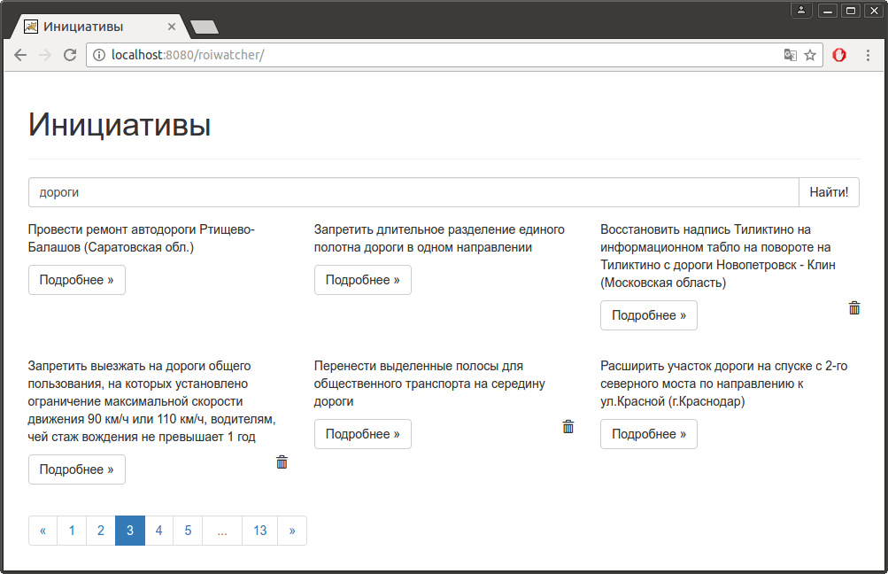

Roi Watcher
===========

Web application monitors site [www.roi.ru](https://www.roi.ru).

Developed using Gradle, Groovy, Spring Framework, Jackson JSON Processor, jsoup, Hibernate, JUnit, Mockito, jQuery,
Bootstrap, Underscore.js and PostgreSQL.

## Requirements

* JRE 8,
* Apache Tomcat 7 or more,
* PostgreSQL.

## Screenshots



## Install

Install [PostgreSQL](https://www.postgresql.org) and create database:

```
$ createuser -D -P -R -S -U postgres roi_watcher
$ createdb -E UTF-8 -O roi_watcher -U postgres roi_watcher
$ psql -f sql/create-schema.sql -U roi_watcher roi_watcher
```

Install JDK.

Install [Apache Tomcat](https://tomcat.apache.org/).

Install [Gradle](https://gradle.org) and build application:

```
$ gradle war
```

Find `roiwatcher.war` in `build/libs` folder and put it in `$CATALINA_BASE/webapps` folder.

Start Apache Tomcat.

Open [http://localhost:8080/roiwatcher](http://localhost:8080/roiwatcher) in browser.
